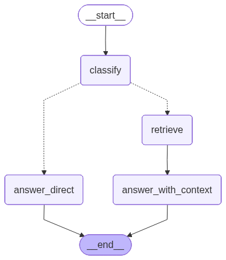
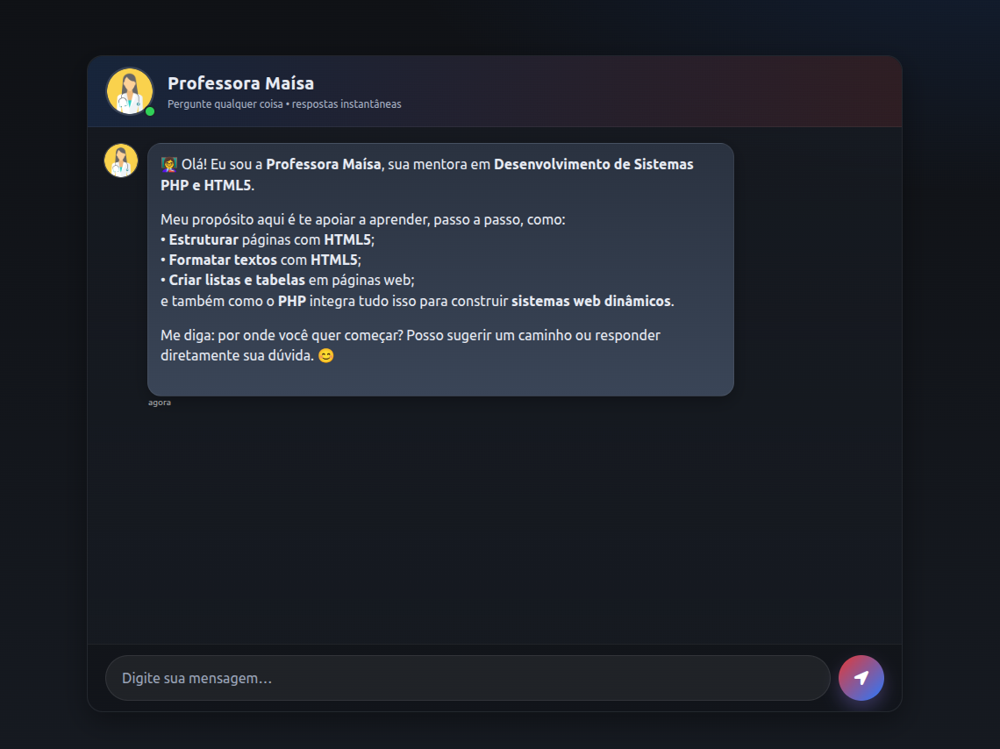
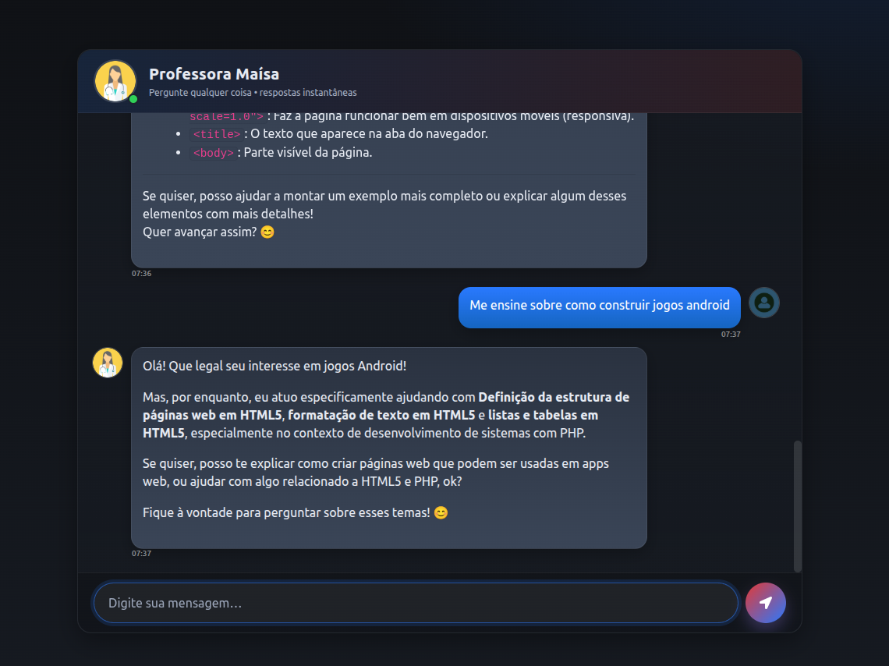
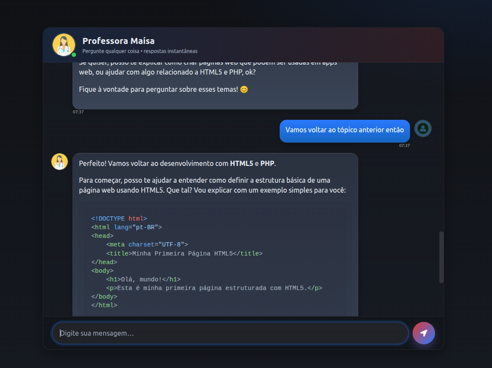

## Visão Geral

Inicialmente, o projeto não foi desenvolvido seguindo uma arquitetura formal — como, por exemplo, uma Arquitetura Hexagonal.
No entanto, é possível identificar a aplicação de conceitos de orquestração de agentes dentro do chatbot.

Mesmo de forma simplificada, o sistema faz uso de agentes autônomos capazes de decidir quando acionar uma ferramenta de busca de contexto e, a partir disso, definir qual resposta deve ser gerada.

A seguir, apresenta-se uma descrição detalhada de toda a estrutura e funcionamento do projeto.

```
┌─────────────────────────────────────────────────────────────┐
│                     USUÁRIO (Frontend)                      │
│                    (templates/chat.html)                    │
└────────────────────┬────────────────────────────────────────┘
                     │ HTTP POST
                     ▼
┌─────────────────────────────────────────────────────────────┐
│         Flask Backend (app.py)                              │
│  ├─ GET /  → Renderiza página + mensagem de boas-vindas    │
│  └─ POST /get → Recebe msg do usuário                      │
└────────────────────┬────────────────────────────────────────┘
                     │
                     ▼
        ┌────────────────────────────────┐
        │   graphChat.py (Orquestrador)   │
        │   agentic_reply(msg)            │
        └────────┬─────────────────────────┘
                 │
        ┌────────▼──────────────────────────┐
        │  LangGraph State Machine           │
        │  (Com memory e checkpointing)      │
        └────────┬──────────────────────────┘
                 │
    ┌────────────┼─────────────────┐
    │            │                 │
    ▼            ▼                 ▼
┌─────────┐ ┌──────────┐  ┌──────────────────┐
│Classify │ │ Retrieve │  │ Answer Generation│
│  Node   │ │   Node   │  │      Node        │
└────┬────┘ └──────┬───┘  └──────────────────┘
     │             │
     │    YES      │
     └─────────────┤
                   │ (Busca no Pinecone)
                   ▼
        ┌──────────────────────┐
        │  Pinecone Vector DB  │
        │  (embeddings +textos)│
        └──────────────────────┘
```

---

### 2. Componentes Principais

#### A. Frontend (`templates/chat.html` + `static/style.css`)

- Interface de chat responsiva
- Envia mensagens para `/get`
- Recebe e exibe respostas do agente

#### B. Backend - Flask (`app.py`)

```python
- GET /        → Renderiza interface inicial
- POST /get    → Recebe mensagem do usuário e retorna resposta
```

#### C. Orquestração de Agente (`src/graphChat.py`)

**LangGraph State Machine com 3 nós principais:**

1. **classify_need_search**

   - Usa classifier_prompt para decidir se precisa buscar no banco de dados
   - Retorna: `needs_search = True/False`

2. **retrieve_docs**

   - Se `needs_search=True`, busca documentos no Pinecone
   - Usa embeddings HuggingFace para calcular similaridade
   - Retorna: `context_chunks` (top 2 documentos similares)

3. **answer_with_context**
   - Gera resposta usando GPT-4 mini
   - Inclui contexto dos documentos (se encontrado)
   - Persona: Professora Maísa

#### D. Sistema de Prompts (`src/prompt.py`)

- **`general_system_prompt`** → Define a persona e o escopo de ensino
- **`classifier_prompt`** → Classifica se precisa buscar contexto
- **`welcome_message`** → Saudação inicial

#### E. Processamento de Dados (`src/helper.py`)

```python
extract_sections_as_documents(pdf_path)
  │
  ├─ Abre PDF com PyMuPDF (fitz)
  ├─ Extrai linhas identificando fontes
  ├─ Divide em SEÇÕES (títulos em MyriadPro-Black)
  ├─ Identifica keywords (subtítulos em MyriadPro-Semibold)
  └─ Retorna: List[Document] para indexação

downloald_hugging_face_embeddings()
  └─ Carrega modelo de embeddings (384 dimensões)
```

#### F. Indexação (`store_index.py`)

```
1. Extrai documentos do PDF
2. Calcula embeddings com HuggingFace
3. Cria índice Pinecone (se não existir)
4. Armazena documentos com embeddings
```

#### G. Logging (`src/agent_logging.py`)

- Log estruturado de cada nó executado
- Rastreia decisões do classificador
- Registra chamadas LLM

---

### 3. Stack Tecnológico

| Camada                | Tecnologia                         |
| --------------------- | ---------------------------------- |
| **Frontend**          | HTML5 + CSS3 + JavaScript          |
| **Backend**           | Flask 3.1.1                        |
| **Orquestração IA**   | LangGraph + LangChain              |
| **LLM**               | OpenAI GPT-4 Mini                  |
| **Embeddings**        | HuggingFace (SentenceTransformers) |
| **Vector DB**         | Pinecone (índice serverless AWS)   |
| **Processamento PDF** | PyPDF + PyMuPDF (fitz)             |
| **Ambiente**          | Python 3.10 + venv                 |

## Decisões de arquitetura

Inicialmente, foi estruturado o fluxo lógico da solução.
A ideia central consistia em, a partir de uma base de dados textual, realizar a transformação dos textos em embeddings e armazená-los em um banco de dados vetorial, de forma que pudessem ser futuramente recuperados por similaridade semântica, dentro de uma estratégia de RAG (Retrieval-Augmented Generation).

Paralelamente, seria desenvolvido um frontend para permitir a interação do usuário com o sistema, enquanto um agente inteligente seria responsável por analisar as mensagens recebidas, decidir quando acionar a ferramenta de busca de contexto e, por fim, gerar a resposta apropriada ao usuário.

Apesar da experiência prévia de aproximadamente um ano e meio com desenvolvimento web, meu foco nos últimos anos esteve voltado à área de automação BPM/RPA com LLMs.
Essa mudança de foco trouxe desafios na parte de tecnologias web, mas foram superados com pesquisa e estudo de materiais de referência disponíveis online.

A linguagem Python foi escolhida por sua forte integração com o ecossistema de Inteligência Artificial, ampla disponibilidade de bibliotecas.
Além disso, a linguagem facilita futuras expansões do sistema com soluções de IA mais robustas, tornando-a a opção mais adequada para este projeto.

O primeiro passo foi o parsing do conteúdo em PDF, seguido pela geração de embeddings.
Para isso, foi utilizado um modelo da Hugging Face, plataforma escolhida pela familiaridade adquirida em projetos anteriores e pela disponibilidade de modelos gratuitos.

O modelo selecionado foi o BAAI/bge-small-en-v1.5, que apresenta um ótimo equilíbrio entre desempenho e eficiência.
Ele gera vetores de 384 dimensões, suficientes para o cálculo de similaridade semântica durante o processo de recuperação de informações.
Além disso, o modelo é leve e adequado para aplicações que priorizam velocidade e custo-benefício.

Os embeddings foram armazenados no Pinecone, um banco de dados vetorial em nuvem.
A escolha do Pinecone se deu principalmente pela simplicidade de uso e pela facilidade de integração com ferramentas de IA, como LangChain.

Ainda que existam alternativas mais escaláveis e otimizadas, o Pinecone atendeu bem às demandas deste projeto.
Ele permite realizar buscas por similaridade de embeddings com alto desempenho, utilizando a métrica de similaridade do cosseno (cosine), definida durante a criação do índice.

As principais tecnologias empregadas na construção do chatbot foram o **LangChain** e o **LangGraph**, frameworks amplamente utilizados no ecossistema de **LLMs (Large Language Models)**.  
Essas ferramentas oferecem **abstrações poderosas para orquestração de agentes**, permitindo a criação de fluxos de decisão complexos e escaláveis com relativa simplicidade.  
Com elas, é possível estruturar o comportamento do agente de forma modular, garantindo maior controle sobre o ciclo de interação e a lógica de execução.

O agente foi projetado para, a cada mensagem recebida do usuário, seguir uma sequência de decisões:

1. **Analisar a necessidade de busca contextual:**  
   O agente utiliza um prompt classificatório para determinar se a resposta requer recuperação de informações externas.

2. **Executar a busca na base vetorial (quando necessário):**  
   Caso identifique essa necessidade, o agente realiza uma consulta no banco de dados vetorial (Pinecone), buscando os embeddings mais semelhantes.

3. **Gerar a resposta final:**  
   Se não houver necessidade de busca, o agente responde diretamente com base no contexto da conversa e nos conhecimentos previamente definidos.

Para garantir a coerência e a precisão das respostas, foram definidos **prompts específicos** para cada etapa do processo:

- **Classificação da necessidade de busca** (decidir entre resposta direta ou busca contextual);
- **Recuperação de contexto** (extração dos documentos relevantes da base vetorial);
- **Geração da resposta final** (formulação da mensagem com base no contexto e persona definida);
- **Guardrails** (mecanismos que evitam que o modelo saia do tema proposto).

Esses componentes asseguram que o chatbot opere de forma controlada, mantendo o alinhamento com o escopo definido.

O chatbot mantém **memória contextual** ao longo da conversa, o que permite compreender referências anteriores e gerar respostas mais coerentes e naturais.  
Essa abordagem oferece uma experiência de diálogo mais fluida, simulando uma interação contínua e inteligente com o usuário.

O modelo escolhido para o projeto foi o **GPT-4.1-mini**.  
Embora modelos maiores geralmente ofereçam maior precisão, a decisão de utilizar uma versão menor foi baseada em um **equilíbrio entre desempenho, custo e velocidade de inferência**.

Atualmente, observa-se uma tendência no mercado de **reduzir a dependência de modelos muito grandes** por meio de **boas práticas de engenharia de contexto**.  
Com prompts bem estruturados, definições claras de persona e contexto relevante, modelos menores podem alcançar resultados altamente satisfatórios em diversas aplicações.

Dessa forma, o uso do **GPT-4.1-mini** mostrou-se mais do que suficiente para os objetivos do chatbot, garantindo:

- **Menor custo operacional**, em comparação com modelos maiores;
- **Maior velocidade de resposta**, fator essencial para uma boa experiência do usuário;
- **Desempenho adequado** dentro do escopo do projeto.

Além disso, a escolha pela **OpenAI** foi motivada pela **familiaridade com sua API**, pela **estabilidade da plataforma** e pela **qualidade consistente** de seus modelos.  
Essa combinação de fatores fez do GPT-4.1-mini uma opção prática, eficiente e totalmente alinhada às necessidades do sistema desenvolvido.

O Flask foi utilizado para erguer a aplicação web, oferecendo rotas simples e eficientes para interação entre o frontend e o chatbot.
A escolha se deu pela facilidade de uso e por ser suficiente para o escopo do projeto.

Por fim, foram implementadas funções de logging para observabilidade do fluxo e acompanhamento do comportamento do modelo.
Devido ao caráter não determinístico dos LLMs, é fundamental ter rastreabilidade das decisões e execuções.
Assim, as interações são registradas no arquivo chat_llm_log.txt, permitindo identificar erros e compreender o comportamento do sistema durante as conversas.

**Extra:** Foi implementado um workflow de **CI/CD** e realizada uma tentativa de deploy na **AWS**.  
A abordagem foi quase totalmente bem-sucedida; entretanto, **um pequeno erro relacionado a permissões de acesso** foi identificado nos estágios finais do processo de deploy e ainda não foi solucionado.

## Comentários gerais e melhorias futuras

#### Indexação

Na etapa de indexação, os embeddings foram gerados a partir de um arquivo PDF, o que guiou a construção do chatbot, projetado para responder apenas com base nesse material.  
Um dos requisitos não atendidos foi a **indexação de diferentes tipos de arquivos**. Alguns testes foram realizados com o **Tesseract**, mas não foi possível utilizar corretamente um OCR para a extração de conteúdo. Da mesma forma, **arquivos de vídeo não foram indexados**.

Outra limitação observada foi a ausência de uma **indexação mais eficiente**. Para lidar com diferentes tipos de conteúdo, seria interessante armazenar, além dos embeddings, **metadados** com palavras-chave relevantes e explorar **motores de busca mais avançados**, como o **Elasticsearch**.

Por fim, para uma aplicação mais robusta e escalável, seria recomendável o uso de **bancos de dados vetoriais mais poderosos**, capazes de lidar melhor com grandes volumes de dados e consultas complexas.

#### Chatbot

A **orquestração dos agentes** também pode ser aprimorada. Atualmente, o RAG implementado utiliza uma estratégia **naive-RAG**, em que a busca é feita com base em uma **simples similaridade semântica**.  
Uma possível melhoria seria a implementação de um **Adaptive RAG**, no qual um agente seria responsável por avaliar se o contexto recuperado é suficiente para responder à pergunta ou se é necessário buscar mais informações, ajustando o prompt dinamicamente.

Além disso, a **estratégia de recuperação** poderia ser **avaliada quantitativamente** por meio de uma **base de testes**, medindo a taxa de acerto das respostas do modelo conforme a estratégia de RAG utilizada.  
Para isso, poderia ser utilizado um **LLM-as-a-Judge**, responsável por comparar as respostas geradas com as respostas esperadas, permitindo medir a precisão e a consistência do sistema.

Junto a isso, embora o prompt garanta explicações claras e respostas eficientes e úteis nos testes, a **adaptação do agente ao tipo de conteúdo preferido e às dificuldades do aluno** ainda não foi plenamente alcançada.  Uma melhoria possível seria a criação de **mais atributos de estado**, permitindo que as preferências do aluno, como formato de material (vídeo, texto, etc.), influenciassem a forma de resposta do modelo.  

Poderiam ser aplicadas **técnicas de aprendizado por reforço (Reinforcement Learning)**, de modo que o agente aprendesse, por meio de recompensas, quais são as preferências individuais do aluno.  
Por exemplo, se o aluno demonstrasse preferência por vídeos, esse formato passaria a ter um **peso maior**, fazendo com que o modelo priorizasse respostas nesse formato. Ao mesmo tempo, o agente deveria manter uma **estratégia de exploração**, sugerindo ocasionalmente novos formatos, permitindo que o aluno experimentasse diferentes abordagens e o agente se adaptasse a possíveis mudanças nas preferências.

Além disso, com a **inserção de novos nós no grafo** e **novos parâmetros de estado**, seria possível armazenar **indicadores de dificuldade do aluno**.  
Assim, à medida que o aluno interagisse, o agente compreenderia melhor suas limitações e **ajustaria o fluxo de respostas** para ajudá-lo a superar essas dificuldades de forma progressiva.

Essas melhorias contribuiriam para uma **orquestração mais inteligente** e para uma **avaliação mais confiável** do desempenho do chatbot.

## FLuxo final do agente



## Exemplo de execução chatbot







